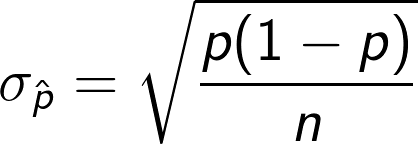

= Auswertung der Umfrage

== Einführung

Unsere Fragestellung lautet: "Hat sich die Relevanz der Story-Line der Games in den letzten 20 Jahren verändert?"
Wir haben versucht dieser Frage in unserer Umfrage nachzugehen.
Um ein besseres Bild der Befragten zu bekommen, waren Fragen nach dem Alter, seit wann und wie oft sie Video&#173;spiele spielen, sehr wichtig.
Die Leitfrage untersuchten wir mit Fragen nach dem Spiel mit der besten Story, wie wichtig Story in einem Video&#173;spiel ist und natürlich wie zufrieden sie mit der Story in heutigen Games sind.
Wir haben die Umfrage in verschiedene Gaming-Foren gestellt, auf Twitter und Facebook verbreitet und es an Freunde und Familie geschickt.
Insgesamt haben über 100 Personen an der Umfrage teilgenommen.

== Kritische Betrachtung

Uns ist bewusst, dass diese Umfrage nicht repräsentativ ist, weil nur wenige Teilnehmer, die diese Umfrage auch selber beantworten (Selbstselektion) wollten, teilnahmen.
Die Selbstselektion ist unserer Meinung nach kein Problem, weil sich die Umfrage an Gamer wendet und darum auch nur Leute mit Affinität zum Spielen teilgenommen haben.

Um die Qualität der Aussagen zu Quantifizieren haben wir den Standardfehler und das Konfidenzintervall berechnet.
Laut (<<khanacademy>>) beträgt der Standardfehler  zwei mal die Standardabweichung, die wir wie folgt berechnen:
Wir nehmen an, das die Antworten aus der Umfrage gleichartig und unabhängig voneinander sind und deshalb Binominal verteilt sind.
Den Standardfehler kann man aus der Standardabweichung ableiten, er beträgt 2 mal die Standardabweichung.
Die Standardabweichung lässt sich mit der folgenden Formel berechnen.

Dabei ist _p_ der gemessene Parameter (also z.B. 0.7, wenn 70% der Befragten eine entsprechende Frage beantworteten) und _n_ die Grösse der Population.
Die Standardabweichung verändert sich mit der Grösse von _p_.
Je extremer gegen 0 oder 1 ein gemessener Wert ist, desto kleiner ist die Standardabweichung.

Für die verschiedenen Fragen in unserer Umfrage schwankt die Standardabweichung zwichen 0.029 (für grosse _p_) und 0.045 (für _p_ nahe 0.5).
Der Standardfehler für die verschiedenen Resultate der Umfrage liegt also zwischen 0.04 und 0.09. (+/- 4% bis +/- 9%)
Der Einfachheit halber rechnen wir durchgehend mit einem Fehler von ≈ 0.075.
Das bedeutet, dass die Resultate mit einem Fehler von +/- 7.5% gelesen werden müssen.

== Analyse der Ergebnisse

An unserer Umfrage haben 85% männliche und 15% weibliche Personen teilgenommen.
Fast 80% der Teilnehmer waren über 23 Jahre alt, davon 45% sogar über 30 Jahre alt.
Wie man sieht, ist der Hauptteil unseres Teilnehmerfeldes eher älter, was für uns gut ist, weil wir aus der Umfrage eine Einschätzung für das Gamen in den letzten 20 Jahren erhalten.
Etwa 85% der Befragten haben bereits als Kinder unter 16 Jahren begonnen Video&#173;spiele zu spielen und ca. die Hälfte spielt heute noch täglich Video&#173;spiele.
20% spielen heute nicht mehr regelmässig Video&#173;spiele.
Für über 80% der Teilnehmer ist die Storyline in einem Video&#173;spiel wichtig.

30% davon sehen die Storyline als wichtigstes Element an und für über 50% ist die Story wichtig, jedoch nicht das wichtigste.
Wir fragten, was in einem Spiel wichtiger sei, Story oder Gameplay.
Etwa doppelt so viele Personen finden Gamplay wichtiger als Story.
Bei der Frage wie diese Personen die Story erleben, haben wir herausgefunden, das etwa 80% der Befragten die Cutscenes und die Sprachausgabe ansehen.
Da die Frage mehrere Antwortsmöglichkeiten hatte, haben wir zudem erfahren das 50% zudem nach Storyelementen wie Tagebücher oder Collectabels suchen.
Nur etwa 10% ist eher uninteressiert an der Story eines Spiels.

Nun kommt eine der wichtigsten Fragen der Umfrage, wir fragten:"Bist du mit der Storyline in Spielen seit 2012 zufrieden?"
Die Antwort hat uns sehr überrascht.
Die meisten sagten, dass sie im Allgemeinen zufrieden sind mit Ge&#173;schich&#173;ten in neuen Video&#173;spielen.
Klar gab es auch Personen, die sagten, dass sie nicht zufrieden sind und sogar eine Person die ganz unzufrieden ist.

Cirka ein Drittel der Befragten erlebt eine Story lieber alleine in einem Singleplayer Spiel, wobei der Rest die Story auch gerne im Multiplayer mit Mitspielern erlebt.
Was braucht eine gute Story?
Fast alle der Befragten waren sich einig, das gute Charakter und Spannung sehr wichtige Elemente eines Video&#173;spiels sind.
Emotionen spielen ebenfalls eine grosse Rolle.
Wir liesen den Teilnehmern die Wahl noch eigene Bemerkungen zu dieser Frage zu hinzuzufügen und bekamen sehr viele einzelne Antworten.
Für eine Person war die Immersion sehr wichtig, also er will sich im Spiel verlieren und ganz in die Welt abtauchen.
Eine sehr spannende Antwort war, das sich eine Person wünscht, dass der Spieler ethische Fragen beantworten muss.

Zum Schluss fragten wir welches Spiel die beste Story ihrer Meinung nach habe.
Um die Antworten etwas zu Gliedern haben wir Spiele-Reihen als eine Antwort gesehen.
Zudem haben wir Witz-Antworten wie _Candy Crush_ oder _Tetris_ nicht zur Kenntnis genommen.
Die absolute Top-Antwort war _The Witcher 3: Wild Hunt_ mit 14 Punkten.
Die zweitmeiste Antwort war die _Mass Effect_-Reihe (ohne _Mass Effect Andromeda_) mit 5 Punkten.
_Half-Life 2_ und _The last of us_ teilen sich den dritten Platz mit 4 Punkten.
Danach gibt es sehr viele Antworten mit 3 Punkten wie _Life is Strange_, _Metal Gear Solid_-Reihe, _Day of the Tentacle_ und die _Untcharted_-Reihe.

Da wir die Entwicklung untersuchen, haben wir versucht die Spiele chronologisch nach Erscheinungsjahr zu gliedern.
Wir haben sie nach Jahrzehnte sortiert und sehr erstaunt gemerkt, dass die meisten der genannten Spiele in diesem Jahrzehnt erschienen sind.
Das heisst die meisten Spiele die in unserer Umfrage genannt wurden sind nach 2010 entwickelt worden.
Insgesamt wurden 22 Spiele aus den Jahren 2010-2018 genannt.
Von 2000-2009 waren es 12 genannte Spiele, von 1990-1999 sechs Spiele und von 1980-1989 waren es noch zwei Spiele.

Als nächstes sortierten wir sie nach Genre.
19 Adventures und 11 Rollenspiele wurden genannt.
Dazu kamen noch drei Shooter sowie drei Jump'n'Run Spiele, zwei Strategie Spiele und eine Simulation.

== Fazit

Die Auswertung der Umfrage ergibt, dass die Ge&#173;schich&#173;ten in Video&#173;spielen immernoch sehr beliebt sind.
Obwohl unser Teilnehmerfeld eher der älteren Gaming-Generation angehört, wurden über 22 Spiele die seit dem Jahr 2010 erschienen sind genannt.
Davon waren zwei Spiele sogar aus dem Jahre 2017.
_Divinity: Originial Sin 2_ und _What Remains of Edith Finch_.
Zwei Spiele mit unglaublich guter Story die bereits einige dazu anregte, es für das Spiel mit der besten Story zu halten.
Hinzu kommt, dass der Hauptteil der Befragten eher zufrieden ist, mit der Entwicklung der Ge&#173;schich&#173;ten in Video&#173;spielen.
Die Variation von Ge&#173;schich&#173;ten ist unglaublich gross, es wurden sechs verschiedene Genres von Spielen genannt.
Aber ganz klar bleiben die besten Ge&#173;schich&#173;ten bei ihren Wurzeln, bei den Adventures und bei den Rollenspielen.

[cols="20,20,50,>10",options="header"]
.Auswertung der genannten Spiele
|===
| Erschienen   | Genre | Titel | Punkte
|1980 -- 1989  | Adventure | Hitchhikers Guide to the Galaxy   | 2
|              | Jump & Run | Prince of Persia                 | 1
|1990 -- 1999  | RPG       | Vampires the Masquerade | 1
|             | Adventure | Metal Gear Solid        | 3
|             |           | Day of the Tentacle     | 3
|             |           | Zelda: Ocarina of Time  | 2
|             |           | Myst                    | 1
|             | RTS       | Dugeon Keeper           | 1
|2000 -- 2009  | Jump & Run | Rattchet & Clank       | 3
|             | Adventure  | Assassins Creed        | 1
|             |            | Syberia                | 1
|             |            | Okami HD               | 1
|             |            | Portal                 | 1
|             | RPG        | Star Wars: Knights of the old Republic | 3
|             |            | Fallout                | 1
|             | Shooter    | Half-Life 2            | 4
|             |            | Call of Duty           | 5
|             |            | Bioshock               | 2
|             | RTS        | Warcraft 3             | 1
|             | RPG (MP)   | World of Warcraft      | 3
|
2010 -- 2017 | Adventure | The last of us          | 4
|             |           | Life is Strange         | 3
|             |           | Uncharted               | 3
|             |           | Beyond: 2 Souls         | 2
|             |           | Heavy Rain              | 2
|             |           | To The Moon             | 2
|             |           | What Remains of Edith Finch| 2
|             |           | Alan Wake               | 1
|             |           | The Walking Dead        | 1
|             |           | Yakuza 5                | 1
|             | RPG       | The Witcher 3           | 14
|             |           | Horizon Zero Dawn       | 2
|             |           | Mass Effect             | 2
|             |           | Skyrim                  | 2
|             |           | Dark Souls              | 1
|             |           | Divinity: Original Sin  | 1
|             |           | The binding of Isaac    | 1
|             |           | Undertale               | 1
|             | Simulation | Rimworld               | 1
|             | Action    | GTA V                   | 2
|             |           | Farcry 4                | 1
|             | Jump & Run | Ori and the blind Forrest | 1
|===
