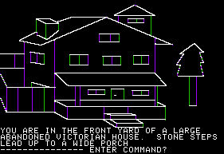

= Die Entstehung von Storytelling in Video&#173;spielen

== Dungeons and Dragons

Ich denke fast jeder hat schonmal von 'Dungeons and Dragons' gehört.
Man verbinden es oft mit jungen Nerds, die im Keller eingeschlossen mit ihren Freunden 'Dungeons und Dragons' spielen.
Nun was ist den dieses 'Dungeons and Dragons'?
Es ist ein sogenanntes Pen and Paper Rollenspiel und wie der Name schon verrät, spielt man es mit Papier und Stift.
Der Spie&#173;ler schlüpft in eine fiktive Rolle und erlebt mit seinen Mitspie&#173;lern verschiedenen Abenteuer.
Der Spielleiter ist wie der Erzähler in einem Buch oder Film und die Spie&#173;ler verkörpern die Charaktere.
Anstatt das vorgegeben ist, wie sich die Charaktere verhalten und was sie als nächstes tun, entscheiden die Spie&#173;ler selber, was sie als nächstes machen.
Man sieht klare Zusammenhänge zu heutigen Role-playing Games.
Wie wir bereits erklärten wird der Spie&#173;ler zum Gestalter der Ge&#173;schich&#173;te und erlebt die Ge&#173;schich&#173;te gleichzeitig mit.

== Role-playing Games

Die Wurzeln der RPG's stammen hauptsächlich aus den oben genannten Pen and Paper Rollenspielen.
Jedoch übernimmt hier der Computer die Rolle des Spiel&#173;leiters, welches na&#173;tür&#173;lich Einschränkungen mit sich zieht.
Es ist vor&#173;geschrieben was passiert, durch die Autoren und die Spielentwickler.
Die ersten Computer Rollenspiele entstanden Mitte der 70er Jahre.
Da Uni&#173;versitäten die einzigen Institutionen waren welche über eingeschränkt benutzbare Rechner verfügten, waren es Studenten welche die ersten Rollenspiele entwickelten.
Speicherplatz war zu dieser Zeit sehr wertvoll, deshalb hatten Universitäten eine strenge Löschpolitik.
Das heisst, dass fast alle zu dieser Zeit entwickelten Rollenspiele gelöscht wurden.
Das älteste noch erhaltene Rollenspiel heisst 'dnd' und wurde 1974 an der Universität Illinois entwickelt.
Heute gibt es diese Rollenspiele immer noch, auch wenn das Genre nicht mehr so gross ist wie vor ein paar Jahren.
Ein gutes Beispiel für ein Video&#173;spiel welches noch sehr klare Änlichkeiten mit 'Dungeons and Dragons' hat ist 'Divinity: Original Sin 2', welches im Herbst 2017 erschienen ist.
Im Spiel gibt es sogar eine Funktion, ein Pen and Paper Spiel mit seinen Freunden zu spielen.
Der Stift und das Papier ist zwar nicht vorhanden aber dennoch ist es fast identisch zu dem Orginal.
Man muss sich die Abenteuer nicht vorstellen, sondern man erlebt sie am Bildschirm mit.
Ob das gut oder schlecht ist, kann jeder für sich selber entscheiden.

== Adventure

Adventures oder auch Abenteuerspiele sind Games, denen eine Story zu Grunde liegt und die meist Einzelspie&#173;ler Spiele sind.
Oft ist es verbunden mit Erkundung und Rätseln.
In gewissen Elementen kommt es dem RPG Genre sehr nahe.
Anders als in den Textadventures steht hier das Erzählen durch Grafik und Sound im Vordergrund.
Am Anfang war das noch schwarze Flächen mit ein paar Strichen.
Heute hingegen kann man mit Grafik alleine sehr viel er&#173;zähl&#173;en und es sieht auch sehr schön aus.

.Mystery House (1980)

In den 90er Jahren starb das Adventure Genre fast aus, weil durch technischen Fortschritt neue Genres ans Tageslicht kamen.
Ego-Shooter wie _Quake_ und _Doom_ regierten den Markt.
Im neuen Jahrtausend aber kamen die Adventures zurück auf die Bühne und feiern bis heute grosse Erfolge.
Nicht nur das, ge&#173;wis&#173;se gelten sogar als Kultklassiker.
So auch 'The Walking Dead' von Telltale Games, dies  ist ein episodisches Spiel, welches eine packende und Herz zer&#173;reissende Ge&#173;schich&#173;te erzählt.
Der Spie&#173;ler wird gezwungen schwere Ent&#173;scheid&#173;ungen zu treffen, die Charaktere das Leben kosten könnten.

== Interactive Fiction

Interactive Fiction, auch bekannt als Textadventures, ist ein Spielegenre, in&#173;dem man nur mit Hilfe von Texten eine Ge&#173;schich&#173;te erzählt.
Das Gameplay be&#173;steht dabei im Aussuchen von Antworten oder diese selber als Text ein&#173;zu&#173;ge&#173;ben.
Es gibt einen jährlichen Wettbewerb in dem gute Textadventures mit aussergewöhnlichen Erzählweisen, ausgezeichnet werden.
Bekannte Bei&#173;spiele dafür sind zum Beispiel, das 1988 erschienene Spiel namens _Corruption_, in welchem man als Insider einen Kriminalfall lösen musste.
Ein weiteres Bei&#173;spiel wäre _Galatea_.
In diesem Spiel muss man an einer Stelle mit der Statue einer Göttin sprechen und Infos aus ihr rausholen.
Die Schwier&#173;ig&#173;keit dabei war, dafür zu sorgen, dass sie nicht gelangweilt wurde.
Denn wäre dies der Fall, hätte sie nicht weiter mit einem geredet.
