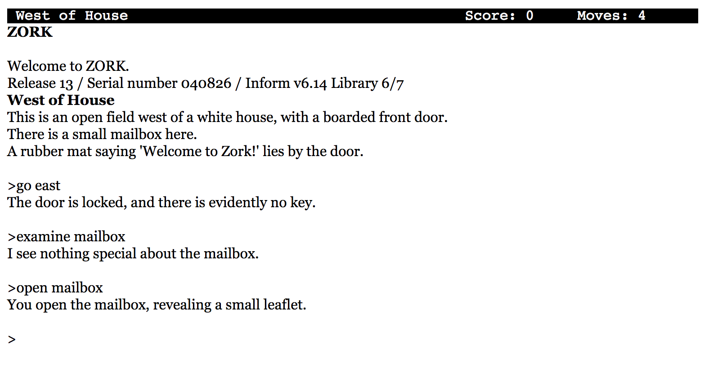
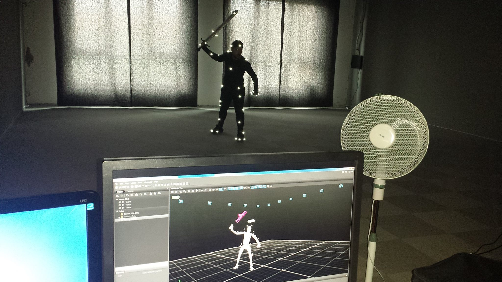
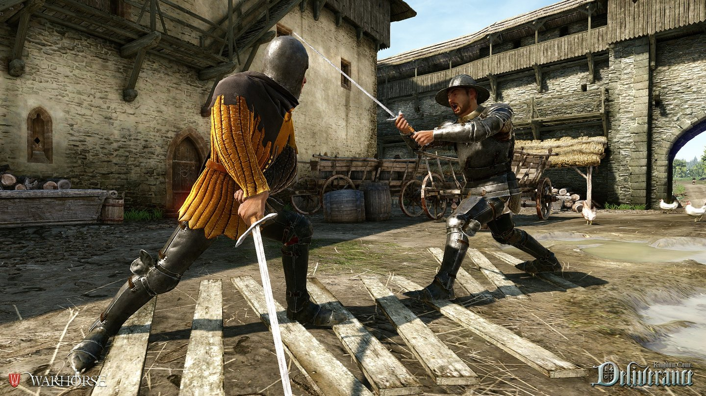
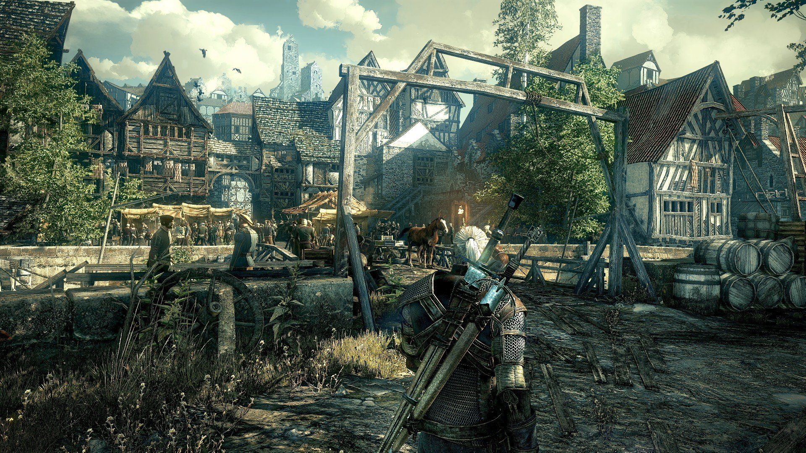

= Story in Videogames

== Ge&#173;schich&#173;ten gab es schon immer

Wieso gibt es überhaupt eine Ge&#173;schich&#173;te in Videogames?
Menschen haben schon immer Gefallen an interessanten Ge&#173;schich&#173;ten gezeigt.
Menschen er&#173;zähl&#173;en sich seit jeher Ge&#173;schich&#173;ten. In Theater, Kino, Gedichte, Literatur, Lieder und nun auch in Spielen.
Bereits die Höhlenmenschen zeichneten ihre Erlebnisse an die Wände.
Seit tausenden von Jahren hat man Theaterstücke aufgeführt und Gedichte geschrieben.
Es ist die Ge&#173;schich&#173;te, die den Menschen packt und interessiert.
Schon Kinder lieben es Ge&#173;schich&#173;ten zu hören und daraus zu lernen.

Im Buch "The Seven Basic Plots: Why We Tell Stories" von (<<Booker2004>>) wird beschrieben, dass es sieben grundlegende Arten gibt auf die sich alle Ge&#173;schich&#173;ten zurückführen lassen.

Das Monster überwinden:: Der Protagonist versucht eine meist böse Macht, die ihn bedroht, zu über&#173;winden.

Von Lumpen zu Reichtum:: Der arme Protagonist bekommt Dinge wie Stärke, Geld oder Macht nur um diese wieder zu verlieren und sie dann zurück zu bekommen, nachdem er als Mensch gewachsen ist.

Die Aufgabe:: Der Protagonist und sein Gefolge versuchen ein wichtiges Objekt zu finden oder einen speziellen Ort zu erreichen. Auf der Reise müssen sie viele Ge&#173;fahren und Versuchungen überwinden.

Reise und Rückkehr:: Der Protagonist geht in ein fremdes Land, überwindet die Gefahren die auf ihn lauern und kehrt dann mit Erfahrung zurück.

Komödie:: Leicht und humorvoller Charakter mit einem glücklichen oder lustigem Ende.

Tragödie:: Der Protagonist ist ein Held mit einer offensichtlier Charakterschwäche oder einem grossen Fehler, was am Ende zu seinem Untergang führt.

Wiedergeburt:: Im Lauf der Ge&#173;schich&#173;te zwingt ein Ereignis den Protagonist seine Art zu än&#173;dern, was ihn oft zu einem besseren Menschen macht.

Auch in Video&#173;spielen sind diese Arten von Ge&#173;schich&#173;ten oft vertreten.
Dabei tauch&#173;en am häufigsten das "Überwinden von Monstern" auf.
Auch "Die Auf&#173;gabe" wird oft als Grundlage verwendet.
Tragödien sind in neuen Adven&#173;tures zu finden wie zum Beispiel _The walking Dead_.

== Ge&#173;schich&#173;ten in Video&#173;spielen

Die ersten Spiele waren Geschicklichkeits- und Denkspiele.
Bald sind Ad&#173;ventures dazu gekommen.
Das erste bekannte Adventure ist 1975 er&#173;sch&#173;ienen.
Es ist ein reines Textadventure und heisst _Adventure_.
Später kamen weiter Text&#173;adventures, besonders bekannt war die _Zork_-Reihe der Firma Infocom.
In den 80er Jahren wurden dann Text&#173;adventures von Grafik-Adventures abgelöst.
Mit den Grafik und Text&#173;adventures hat man dann angefangen in Games Ge&#173;schich&#173;ten zu er&#173;zähl&#173;en und bald danach sind Role-Playing Games dazugekommen.

.Die erste Szene in "Zork" (1980)

== Linearität

Im Theater oder in der Literatur wird eine Ge&#173;schich&#173;te linear er&#173;zählt.
Im griechischen Theater gab es eine Einheit von Raum und Zeit, dass heisst, wenn das Theater zwei Stunden lang dauerte, so dauerte auch die Ge&#173;schich&#173;te, die er&#173;zählt wird, zwei Stunden lang.
Später hat man mit Szenenwechsel Zeit&#173;sprünge vornehmen können.
In Literatur, Theater und Film kann man mehrere Zeit&#173;ebenen parallel er&#173;zähl&#173;en.
Dennoch wird die Ge&#173;schich&#173;te vom Erzähler in einer vorgegebenen Reihenfolge erzählt.
In einem Spiel kann dies auch so ge&#173;sche&#173;hen, zusätzlich besteht die Möglichkeit dem Spie&#173;ler die Steuerung des Geschichts&#173;flusses zu er&#173;möglichen.

Man verändert die Ge&#173;schich&#173;te je nach dem, was mal als Spie&#173;ler in dem Spiel macht.
Zudem gibt es Spiele deren Ge&#173;schich&#173;te durch die Handlungen des Spie&#173;lers beinflusst werden oder erst durch diese entstehen, was einer non-linearer Ge&#173;schich&#173;te entspricht.
Für Story&#173;teller ist es viel anspruchsvoller eine non-lineare Ge&#173;schich&#173;te zu schreiben in dem sie dem Spie&#173;ler die Entscheidung lassen was und wann er es erlebt.

Es gibt auch Techniken, den Fluss einer dynamischen Ge&#173;schich&#173;te so zu steu&#173;ern, dass der Spie&#173;ler den Hauptstrang so erlebt, wie es der Autor vor&#173;ge&#173;sehen hat.
Der Spie&#173;ler muss zum Beispiel einen bestimmten Ort er&#173;reich&#173;en um in der Story weiter zu kommen.
Es gibt auch Games die keine Story von einem Autor haben, sondern deren Ge&#173;schich&#173;te automatisch, aufgrund von Aktionen und Reaktionen des Spie&#173;lers generiert wird.

== Der Einfluss von Film

Durch den technischen Fortschritt, vorallem im Bereich der Grafik, können Spiele immer näher an das visuelle Aussehen von Filmen kommen.
Wie (<<Pöhnert2005>>) schreibt, wurden mit den immer besser werdenden tech&#173;ni&#173;schen Gegebenheiten, immer längere und bessere spiel&#173;film&#173;artige Sequenzen möglich.
Diese Sequenzen nennt man auch 'Cutscenes', welche zur Belohnung des Spie&#173;lers und auch der Erzählung der Ge&#173;schich&#173;te beitragen.

Heute, 12 Jahre später, sind die technischen Möglichkeiten so wei&#173;ter&#173;ent&#173;wickelt, dass es möglich ist, quasi realistische Bilder im eigentlichem Spiel zu haben.
Zum Beispiel wird mit sogennantem 'Motion capturing' das Aus&#173;sehen und die Bewegung von Schauspie&#173;lern aufgenommen und digitalisiert.
Die sich daraus ergebenen Daten machen es möglich, das sich eine Figur im Spiel na&#173;tür&#173;lich bewegt, auch wenn die jeweilige Aktion oder Handlung nicht vorgegeben war.

.Motion Capture für "Kingdom Come: Deliverance" (2017)

.Kampfszene aus "Kingdom Come: Deliverance" (2017)

Weil unterdessen Spiele eine grosse Ähnlichkeit mit dem Film haben, ist es interessant was zu sehen, was Filmregisseure zu Spielen sagen.

== Filmregisseure über Games

In einem Interview das (<<bishop2013>>) mit Steven Spielberg und George Lucas geführt hat, wird über Storytelling in Games diskutiert.

[quote]
--
"Telling a story, it’s a very complicated process," he said.
"You’re leading the audience along.
You are showing them things.
Giving them insights.
It’s a very complicated construct and very carefully put together.
If you just let everybody go in and do whatever they want then it’s not a story anymore.
It’s simply a game."
--

Wir verstehen, was uns Lucas hier sagen will, jedoch sehen wir dies etwas anders.
Es ist nicht einfach nur ein Spiel, sondern der Spie&#173;ler selber wird zum Gestalter der Ge&#173;schich&#173;te und kann diese erleben wie er es für sich persönlich gerne hätte.
Der Spie&#173;ler wird teilweise sogar dazu animiert, die Ge&#173;schich&#173;te des Spieles selber zu gestalten oder herauszufinden.
Somit gibt es sehr viele Interpretationen, auch in der Literatur oder im Film wird etwas ähmliches gemacht.
Man lässt die Ge&#173;schich&#173;te offen und lässt die Leser und die Betrachter spekulieren was passieren könnte.
Dadurch öffnet man eine völlig neue He&#173;ran&#173;gehens&#173;weise an die Ge&#173;schich&#173;te.
Ob dies in einem Spiel oder einem Film passiert ist nicht relevant.
Zum Beispiel in der Fernseh-Serie _Game of Thrones_, nach jeder Staffel gibt es im Internet viele Theorien darüber, was nun als nächstes in der Serie passieren könnte oder wie die Serie Enden wird.

Dasselbe gibt es auch in Video&#173;spielen, in _World of Warcraft_, dass eine immer weitergehende Ge&#173;schich&#173;te besitzt, werden immer wieder Theorien aufgestellt was mit den Charakteren und der Spielwelt als nächstes passiert.
In _World of Warcraft_ ist die Art wie die Ge&#173;schich&#173;te erzählt wird sehr speziell.
Der Spie&#173;ler ist ein Teil der Spielwelt und hat auch Einfluss auf diese.
Im Jahr 2017 ist das neue Erweiterungs-Paket für _World of Warcraft_ erschienen.
Die Spie&#173;ler machten sich auf den Weg neue Ort zu entdecken, stärker zu werden und neue Verbündete zu gewinnen.
Die Ge&#173;schich&#173;te von _World of Warcraft_ ist eine Klassische "Monster überwinden"-Story, jedoch gibt es nicht nur einen Pro&#173;ta&#173;gonisten sondern die Spie&#173;ler müssen zusammen gegen die Monster kämpfen.
Wir sehen das so, dass dies auch eine Ge&#173;schich&#173;te ist und nicht nur ein Spiel, auch wenn jeder das machen kann was er will.

George Lucas sagte auch (ebenda):

[quote]
--
"Storytelling is about two things," he said.
"It’s about character and plot."
Character is what movies and television offer, he said, but it’s a concept the gaming industry is just now discovering.
"Like sports. It’s about Tebow.
It’s about, you know, Kobe.
They’re starting to realize that if they focus on the characters it makes the game much richer."

"But by its very nature there cannot be a plot in a game.
You can’t plot out a football game.
You can’t plot out feeding Christians to lions.
It’s not a plot."
--

Nun auch diese Aussage finden wir etwas fragwürdig.
Für uns kann es auch in einem Spiel eine gute Handlung haben.
Man nehme _The Witcher 3: The Wild Hunt_ als Beispiel, ein Spiel welches auf einem Roman basiert.
Wir sind uns sicher, dass jeder der das Spiel gespielt und das Buch gelesen hat, sagen wird, dass die Story im Spiel viel besser vermittelt wird als im Buch.
Die Ge&#173;schich&#173;te des Spieles ist sehr vielfältig.
Es werden viele kurze Ge&#173;schich&#173;ten erzählt, die auch zur HauptGe&#173;schich&#173;te beitragen.
Viele von diesen Ge&#173;schich&#173;ten fallen wieder in die oben genannten Schemata: es gibt "Monster überwinden"-Storys, "Die Aufgabe"-Passagen und auch "Tragödien" werden erzählt.

.The Witcher 3 (2015)

Es gibt auch sehr gute Beispiele von Spielen,  die nicht auf einem Buch basieren.
Die _Mass Effect_-Reihe, welche sich auch an den verschiedenen Handlungstypen orientieren.
Wir stehen damit im Widerspruch zur Aussage von Lucas, denn wir meinen, dass es durchaus auch in Video&#173;spielen einen "Plot" geben kann.
