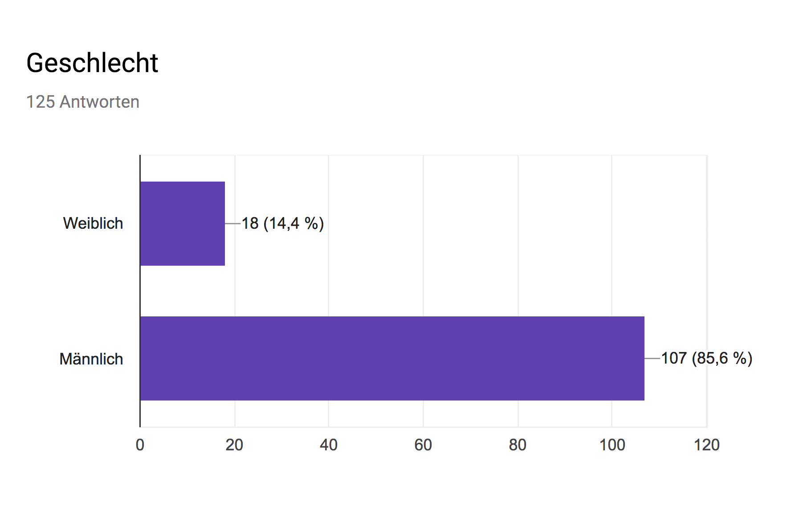
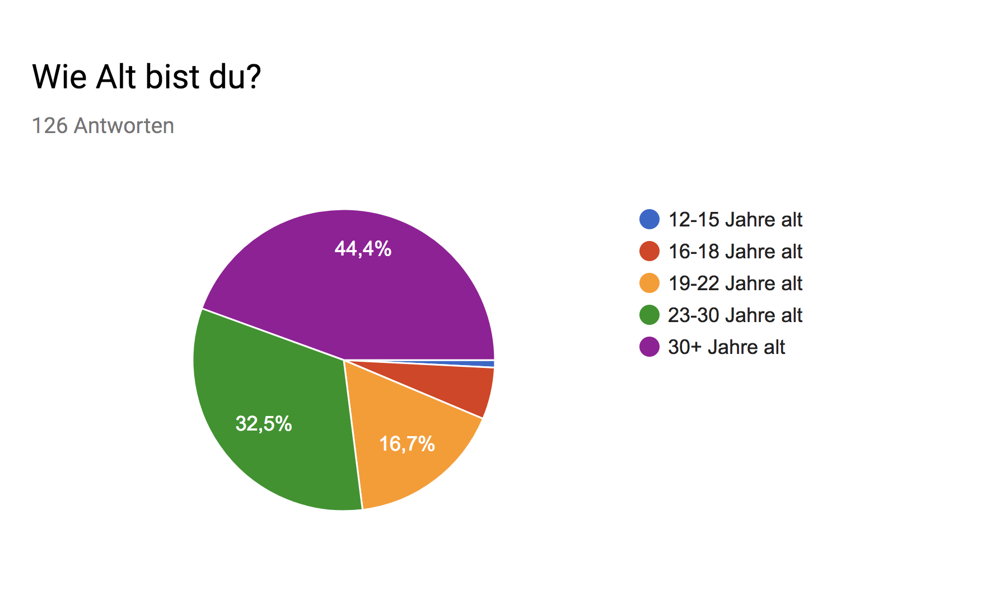
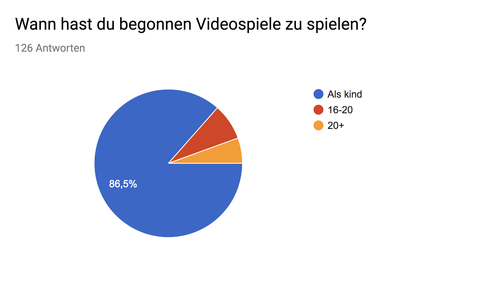
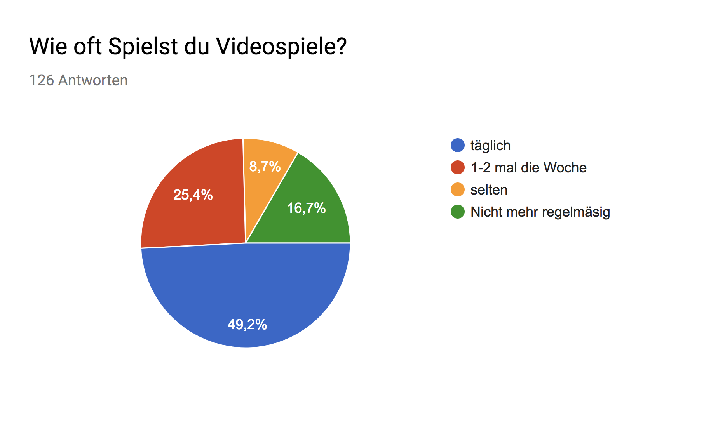
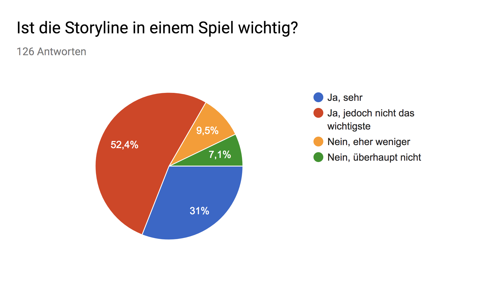
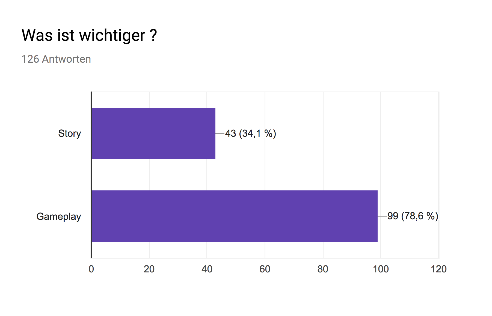
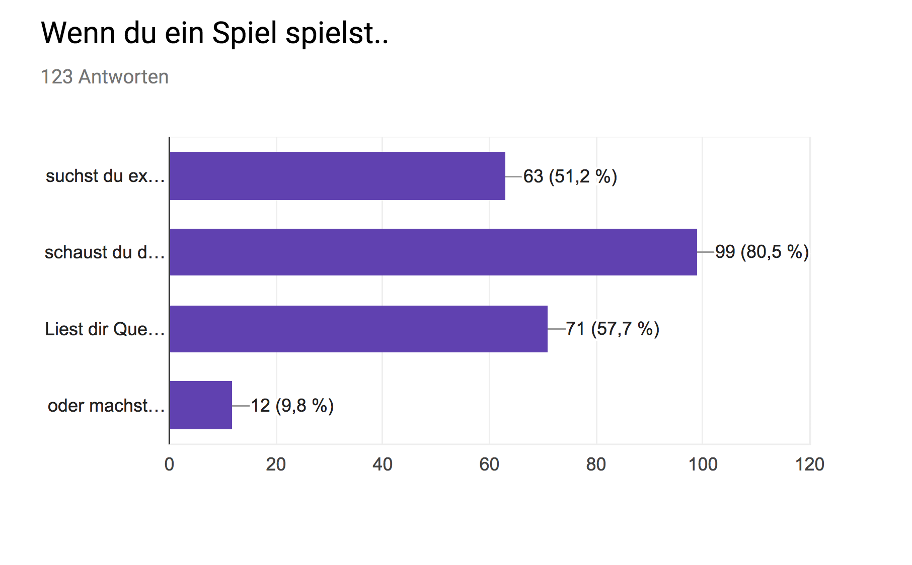
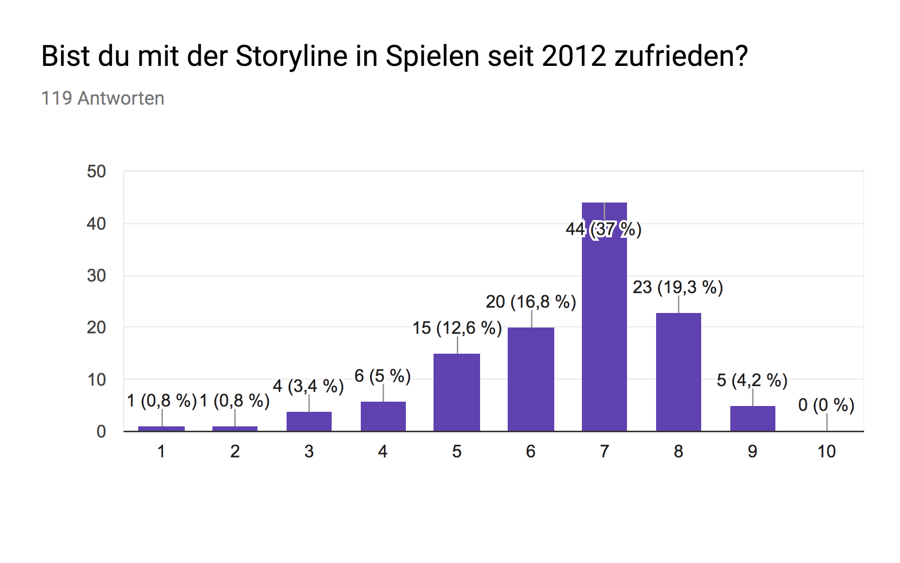
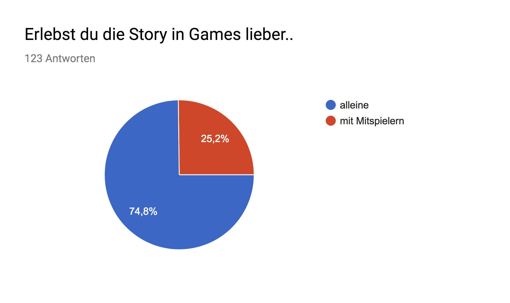
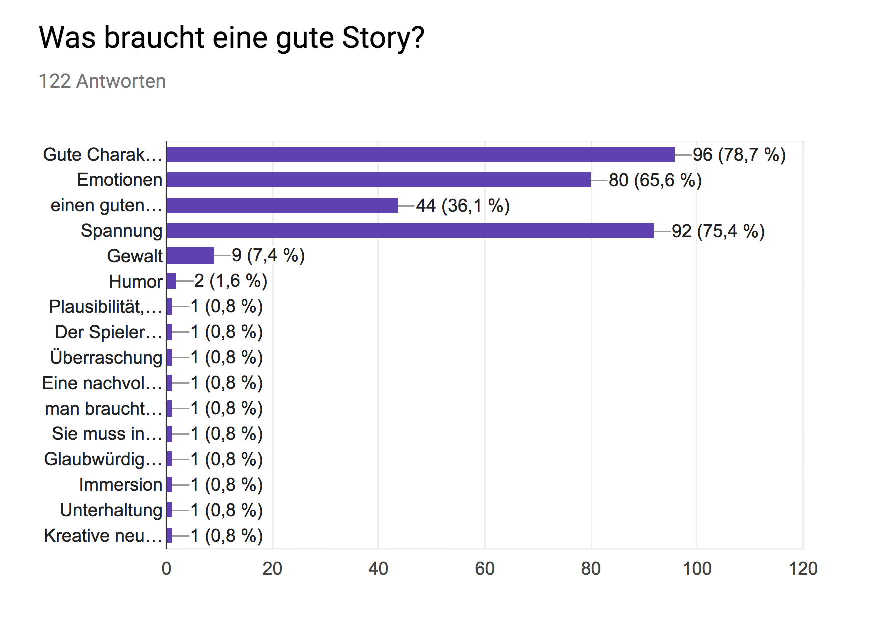

[appendix]
= Auswertung

.Frage 1 -- Geschlecht

.Frage 2 -- Alter

.Frage 3 -- Begonnen zu spielen

.Frage 4 -- Wie oft spielen

.Frage 5 -- Storyline wichtig

.Frage 6 -- Wichtiger Story oder Gameplay

.Frage 7 -- Wie spielst Du

.Frage 8 -- Zufriedenheit

.Frage 9 -- Story erleben

.Frage 10 -- Was braucht eine gute Story

